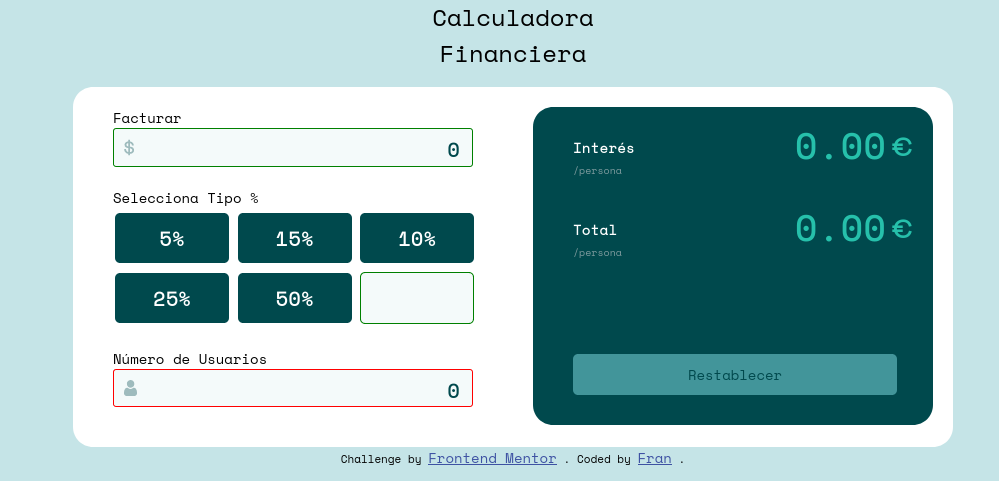
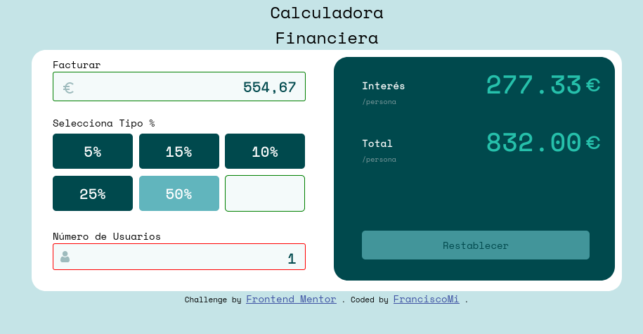
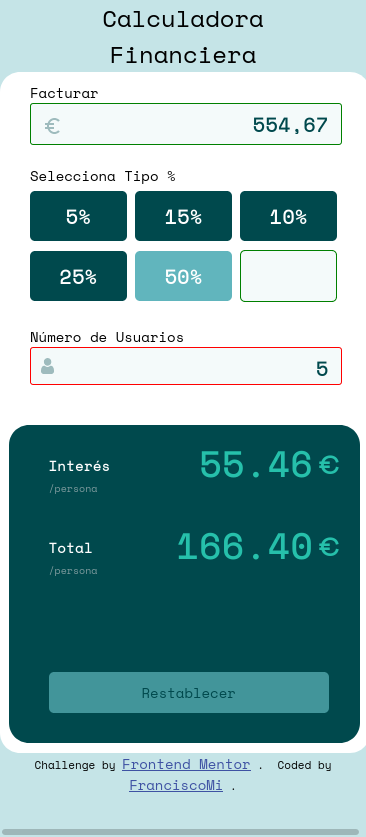

# Frontend Mentor - Tip calculator app solution

This is a solution to the [Tip calculator app challenge on Frontend Mentor](https://www.frontendmentor.io/challenges/tip-calculator-app-ugJNGbJUX).

## Table of contents

- [Overview](#overview)
  - [The challenge](#the-challenge)
  - [Screenshot](#screenshot)
  - [Links](#links)
- [My process](#my-process)
  - [Built with](#built-with)
  - [What I learned](#what-i-learned)
  - [Useful resources](#useful-resources)
- [Author](#author)
- [Acknowledgments](#acknowledgments)

## Overview

### The challenge

Users should be able to:

- View the optimal layout for the app depending on their device's screen size
- See hover states for all interactive elements on the page
- Calculate the correct tip and total cost of the bill per person

### Screenshot







### Links

- Solution URL: [Github Solution](https://github.com/FranciscoMi/tip-calculator-app-main)
- Live Site URL: [CodeSandBox](https://rj8p9.csb.app/)

## My process

- (07-16-2021): Project start
- (07-17-2021): HTML file creation
- (07-18-2021): Added CSS. Try not to use Flexbox
- (07-19-2021): Js code started
- (07-21-2021): Beginning of adaptation to mobiles. Media Queries
- (07-26-2021): Add Placeholder and Vertical Align

### Built with

- Semantic HTML5 markup
- CSS custom properties
- Mobile-first workflow

### What I learned

- Creation and design of regular expressions to truncate numbers with decimals. Interest rates are not rounded, they are generally truncated. To achieve this result we create a pattern and compare it with the result variable.

These expressions only work with strings, they are not allowed in numeric scopes. So, if the variable is numeric, it must first be transformed into a String field.

```js
const regex = /^\d+(\.\d{0,2})?/
}
```

Then we have:

- / 'pattern' / -> Regular expressions are enclosed in backslashes, so that it can be understood by the js
- ^ -> Tells the code to take the expression from the beginning of the string
- \ d + -> Indicates that 1 or more numeric digits are taken
- () -> The parentheses are used to generate a substring that groups the decimal section
- \. -> We indicate the decimal point
- \ d {0,2} -> Between braces we establish that the result is composed of 0-2 decimal digits -? -> We indicate in this way that the previous group is optional, matching 0 or 1 times

Finally, we convert the value of the numeric field into a string, and set the matcher according to the pattern:

```js
let tip = (facturar * valor) / usuario
let tipString = tip.toString().match(regex)[0]
```

### Useful resources

- [Regular Expressions Validation](https://regexr.com/) - This is a tool to check the use and results of regular expressions. Very useful to learn.
- [Markup Validation Service](https://validator.w3.org/) - Another online tool to validate the HTML code.
- [HTML5 for Materminds] (http://www.formasterminds.com/html5_for_masterminds_3rd_edition/) - A good beginner's book that brings together the basics of HTML5, JavaScript, and CSS with clear examples.

## Author

- Frontend Mentor - [@FranciscoMi](https://www.frontendmentor.io/profile/FranciscoMi)
